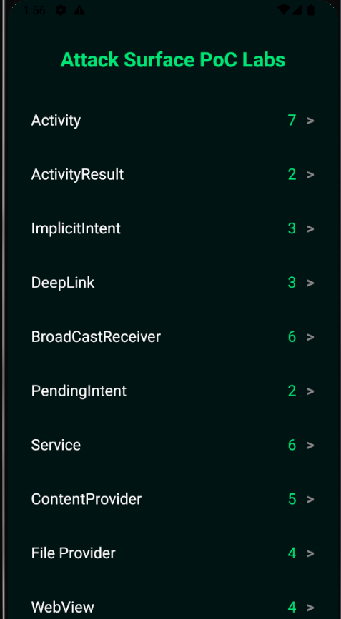

# Attack Surface PoC Labs - Hextree Consolidated 🛡️


A practical Android Security project that consolidates **41 real-world PoCs (Proof of Concepts)** into a single application.

Originally solved as separate labs from the **Hextree.io** Android Security course, this project was rebuilt to **deepen understanding of Android internals and vulnerability exploitation** — transforming isolated challenges into a **complete attack surface playground**.

---

## 📱 Project Overview

This application provides a **unified environment** to explore and exploit common Android vulnerabilities across different components. It focuses on **Inter-Process Communication (IPC)** weaknesses and real-world attack scenarios.

### 🚀 Key Features

- 🔹 **41 Consolidated PoCs:** Every solution integrated into one APK.
- 🔹 **Technical Categorization:** Organized by Android component and specific attack vector.
- 🔹 **Hands-on Exploitation:** Focuses on real-world scenarios like Intent-in-Intent and AIDL hijacking.
- 🔹 **Security Reference:** Serves as a practical playground for Pentesters and AppSec Engineers.

---

## 📸 Screenshots

<p align="center">
  
</p>

---

## 📂 Categories & Technical Breakdown

| Category               | Labs | Technical Focus & Exploitation Concepts                                             |
| :--------------------- | :--: | :---------------------------------------------------------------------------------- |
| **Activity**           |  7   | Exported components, Intent-in-Intent, State machine bypass, and Lifecycle tricks.  |
| **ActivityResult**     |  2   | Result hijacking and intercepting sensitive flags via `setResult()`.                |
| **Implicit Intent**    |  3   | Hijacking non-specific intents and manipulating intent conditions.                  |
| **DeepLink**           |  3   | Custom schemes (`hex://`), Intent schemes, and Web login hijacking.                 |
| **Broadcast Receiver** |  6   | Hijacking system/notification intents and exploiting notification button responses. |
| **PendingIntent**      |  2   | Mutable PendingIntent hijacking and privilege escalation.                           |
| **Service**            |  6   | Exploiting AIDL interfaces, Message Handlers, and Service Lifecycle.                |
| **Content Provider**   |  5   | SQL Injection, URI Matcher exploitation, and unauthorized Provider access.          |
| **File Provider**      |  4   | Path Traversal, Root-file access, and Overwriting Shared Preferences.               |
| **WebView**            |  4   | `@JavascriptInterface` bridge exploitation, XSS, and SOP bypass via `content://`.   |

---

## 🛠️ Build & Installation

```bash
git clone https://github.com/0xbedo/Android-Attack-Surface-Labs.git
```

## 📥 Download

You can download the ready-to-install APK from the [Releases Section](https://github.com/0xbedo/Android-Attack-Surface-Labs/releases).
